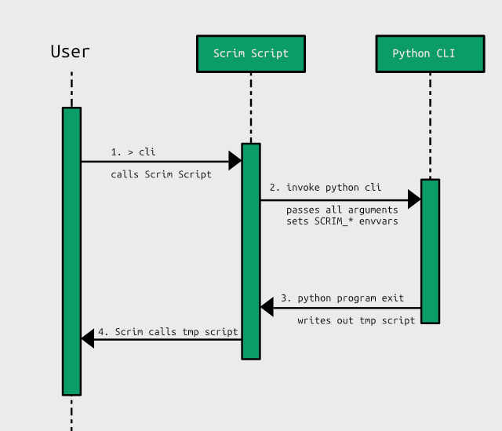

=====
Scrim
=====
.. image:: https://travis-ci.org/danbradham/scrim.svg?branch=master
    :target: https://travis-ci.org/danbradham/scrim

A *scrim* is a piece of cloth that's opaque until lit from behind. Like a scrim, **Scrim** provides opaque scripts to wrap python command line tools while providing an api to send shell commands up to the users shell.

Why would I need Scrim?
=======================
When writing command line tools in python, changes to--let's say--environment variables, don't persist when the python process exits. This means we can't write certain types of tools in pure python, we need to revert to our shell's scripting language instead. That's why clis for tools like virtualenv are written in shell scripting languages instead of pure python. **Scrim** provides opaque shell scripts that wrap your python cli, so you can continue writing the interfaces for your python programs in python.

How does it work?
=================

In this diagram the *Scrim Script* is the opaque shell script provided by the scrim package. Following along with the diagram, the *User* calls the cli command. This invokes the *Scrim Script* which sets these environment variables:

  - **SCRIM_SHELL** - name of the shell process (powershell.exe, cmd.exe)
  - **SCRIM_PATH** - path to temp script which python will write
  - **SCRIM_SCRIPT** - full path to the Scrim Script
  - **SCRIM_AUTO_WRITE** - whether or not to automatically write the temp script which python exits.

Then the *Scrim Script* invokes the actual *Python CLI* passing all arguments from the *User*. The *Python CLI* can now use the scrim api to append commands to a list. When the python program exits, the list of commands is written to a temporary script file. The *Scrim Script* now continues and executes the temporary script file if it exists. Finally the *Scrim Script* removes any temporary files and unsets the above environment variables.

Quickstart
==========
First add **Scrim** scripts to your project using **Scrim's** cli.

::

    > cd mytool
    > scrim add --entry_point mytool

    Creating scripts for: mytool
        Created bin/mytool.bat
        Created bin/mytool.ps1

    Add the following section to your package setup:

    scripts=[
        'bin/mytool.bat',
        'bin/mytool.ps1',
    ],

Assume that *mytool* is a python project containing a setup.py file. Here we've provided `scrim add` with the name of the entry_point to our python cli. If you've got multiple entry_points already defined in your package you can use::

    > scrim add --all_entry_points
    ...

This will add *Scrim Scripts* to each console_script you've defined in entry_points.

You'll notice a limitation in the output above. Currently Scrim only provides scripts for Powershell and Batch. The plan is to provide wrappers for all of the popular shell scripting languages (bash, csh, fish). But, for now...Windows.

Now that you're project has Scrim added to it let's take a look at the python side.

.. code-block:: python

    import click
    from scrim import get_scrim
    scrim = get_scrim()

    @click.command()
    def mytool():
        if scrim.shell == 'powershell.exe':
            scrim.append('$env:MYTOOL="Hello World!"')
        elif scrim.shell == 'cmd.exe':
            scrim.append('set MYTOOL="Hello World!"')

    if __name__ == '__main__':
        mytool()

We use `get_scrim` to get an instance of `Scrim`. Then we append commands to the scrim and those will be executed by the *Scrim script* that invokes the python cli after python exits. In this case the environment variable *MYTOOL* will be set to *Hello World!* in your shell.

Tests
=====
Use nose to manually run the scrim test suite.

::

    > nosetests -v

The Future
==========

v0.1.0
------

  - Add support for bash, fish, and csh
  - Add commands to the Scrim object that support each shell scripting language.
    - Scrim.echo for example would append a Write-Host call to the Scrim for powershell and echo for cmd and bash
  - Parse setup.cfg as well as setup.py to find all entry_points

Known Issues
------------

  - Batch scrim script can't be named the same as the python entry_point. Since the exes take precidence over bat files the exe generated by setuptools will be called, not the scrim script. For now one solution is to prefix the python entry_point with *py*.
